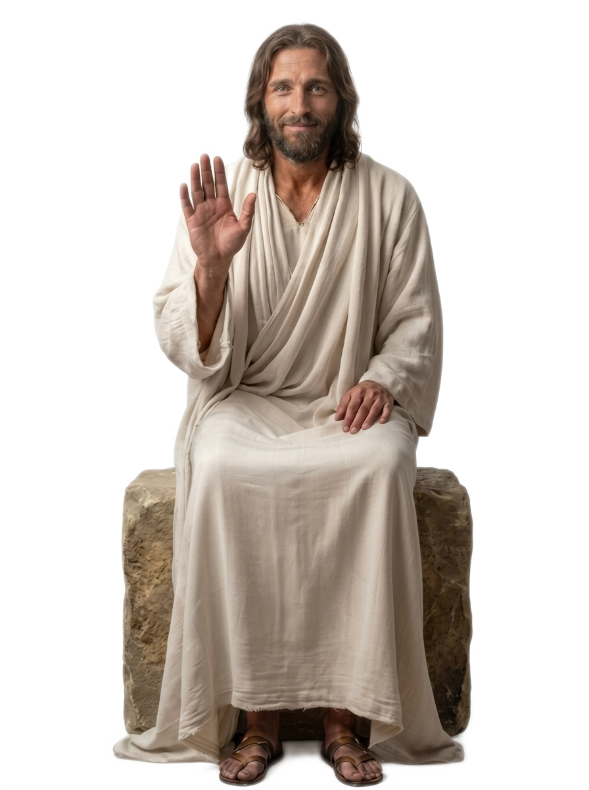

<!--

# 🪧 Complementar

## # Links Externos

Os links da coluna Principal abrirão aqui e serão primariamente:

- 📔 definições de palavras do [Wikicionário](https://pt.m.wiktionary.org/)
- 📰 artigos do [Wikipédia](https://pt.m.wikipedia.org/)
- 📰 artigos do Portal [Luz Espírita](https://www.luzespirita.org.br/){:target="_blank"}
- ✝️ passagens da bíblia [ARC](https://pt.m.wikipedia.org/wiki/Almeida_Revista_e_Corrigida), pela [SBB](https://www.sbb.org.br/){:target="_blank"} via [Bible.com](https://www.bible.com/)

Adicionalmente, conteúdo ilustrativo ou audio/visual de:

- 🖼️ diagramas, ilustrações, ou pinturas representativas da [Wikimedia Commons](https://commons.wikimedia.org/)
- 🗺️ mapas de [OpenStreetMap](https://www.openstreetmap.org/){:target="_blank"} via [Leaflet](https://leafletjs.com/) indicando locais citados
- 🎬 vídeos da [Igreja de Jesus Cristo dos Santos dos Últimos Dias](https://www.churchofjesuschrist.org/?lang=por)
- 🎬 vídeos do show de TV [Os Escolhidos](https://osescolhidos.tv/)
- 🎬 vídeos do [Bible Project](https://bibleproject.com/portugues){:target="_blank"} (Brasil)
<!-- - 🎬 vídeos do canal [Amigos da Luz](https://www.youtube.com/channel/UCYatoBlRirWhMrgjTK0b6Pg)-->

<!-- COLUNA 3 - EXT (Splash Jesus) -->

